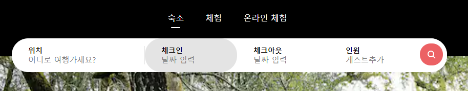
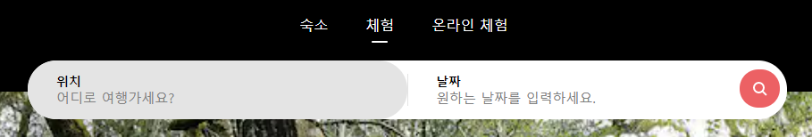
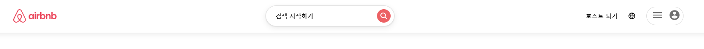
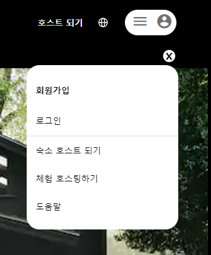
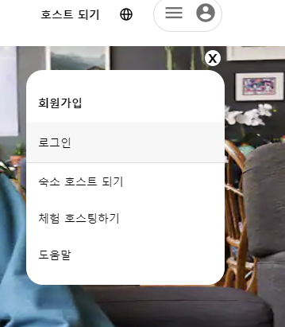
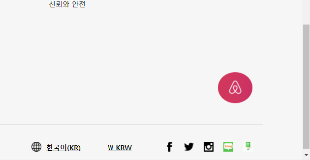
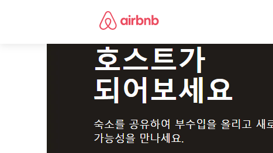
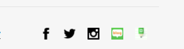

# Airbnb 홈페이지(기말)

## 이벤트 기능

- 상단 가운데의 숙소, 체험, 온라인 체험 메뉴에서 클릭할때마다 아래의 검색창이 달라지도록 구현하였다. 
또한 숙소, 체험, 온라인 체험 메뉴과 검색창(위치, 체크인, 체크아웃, 인원, 날짜)에 마우스만 갖다대도(hover) 조금씩 달라지도록 효과를 주었다.

 

 

- 스크롤을 내리면 헤더가 전체적으로 바뀌어 따라내려오도록 하였다.
또한 전체헤더의 아랫부분에 shadow효과를 주었고 + 검색 시작하기에 마우스를 갖다대면 입체적으로 보이도록 효과를 주었고 + 오른쪽 상단의 membership(회원가입)에도 마우스를 갖다대면 입체적으로 보이도록 효과를 주었다.

 

- 오른쪽 상단의 membership(회원가입)을 클릭하면 새로운 메뉴가 나오도록 하였다 -> 회원가입, 로그인, 숙소 호스트 되기, 체험 호스팅하기, 도움말
이 메뉴를 닫을때는 메뉴 위에보이는 X를 누르면 닫혀진다.(X를 누르기위해 hover했을때 shadow 효과도 줌) 
또한 회원가입, 로그인, 숙소 호스트 되기, 체험 호스팅하기, 도움말에 마우스를 갖다대면 연한회색으로 바뀌는 효과를 주었다. 스크롤을 내렸을때에도 바뀐 헤더의 membership(회원가입)을 누르면 같은 반응을 보이도록 하였다.

 

 

- 스크롤을 내리는 순간 오른쪽하단에 핑크색의 에어비앤비 버튼이 생기는데 이 버튼을 활용하여 scroll to top 기능을 넣었다. (smooth)
스크롤 이벤트가 발생하지 않으면 보이지 않지만 스크롤 이벤트가 발생하는 순간 보이도록 하였다.

- 헤더가 바뀌면서 헤더의 왼쪽에 있는 에어비앤비 로고가 핑크색으로 바뀐것을 확인할 수 있다. 이를 클릭하면 scroll to top 기능처럼 맨처음 화면으로 바로 되돌아간다. (auto)

- 추가로 모든 하이퍼링크는 에어비앤비와 같은 링크로 걸어주었다.
하단의 아이콘에도 걸어주어서 이를통해 에어비앤비 전용 페이스북, 트위터, 인스타그램, 블로그 등등.. 으로 이동할 수 있다.

## 아쉬웠던점

- 이 수업을 들으면서 에어비앤비 홈페이지가 2번이나 바뀌었다... 또 언제바뀔지 모르기때문에.. 맨 처음에 코딩을 시작했을때의 웹페이지를 그대로 진행하였다. 
그래도 스크롤을 내렸을때 보이는 화면들은 사진만 바뀌는 경우가 대부분이여서 현재의 에어비앤비 웹페이지에 맞게(중간제출때와는 조금!!! 다르게) 수정하였다.

- 이벤트하나 넣고 헤더를 하나 만드는데도 간단할줄 알았는데 코드가 정~~~말 길었다.... 중간중간 '내가 효율적이지 못하게 하나?...' 라는 의구심이 들었지만
 그럴때마다 '일단은 내가 목표한데까지 완성만 하자.' 라는 생각으로 나 자신을 다독였던 것 같다.

## 배운점 & 느낀점

- 사실 저학년 과목이고 재수강이다 보니 처음에는 이해하는 부분에 있어서 식은 죽 먹기라고 생각했다....ㅎ 결론은 자만했던 나 자신을 반성하게 되었다... 1학년 때 메모장에다가 html을 작성했었던 것 같은데... 지금 생각해 보면 그때는 장난(?) 수준이었던 것 같다. 
이번에 이 수업을 통해 진짜 웹 기초 프로그래밍을 배우게 된 것 같아서 뿌듯했다.
html은 물론이고 css, js까지 배울 수 있어서 얻어 가는 게 많았고 시험을 보는 게 아니라 한 학기 동안 내가 직접 클론 코딩을 함으로써 프로젝트를 진행했기 때문에 배웠던 지식들이 기억에 오래 남을 것 같다. 
개발일지가 과제였지만 나중에는 '이 땐 이랬었구나', '이렇게 하는거였지?' 하고 언제든지 되돌아볼 수 있는 일기장(?)이 생긴 것 같아서 이 또한 너무 가치 있었던 과제라는 생각이 들었다. 